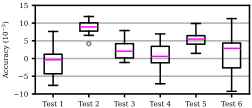

# Minimal single-panel Python boxplot recipe

Create clean, publication-ready boxplots comparing measurements across multiple methods or experimental conditions, without fighting Matplotlib defaults.
This deliberately simple figure recipe produces a single, high-quality panel that imports cleanly into LaTeX and Microsoft Word.
It is optimized for single-column figure panels in two-column journal and conference papers.
An extended version addresses comparisons of grouped measurements with color-coded boxplots and a dedicated legend.


## Preview




## Scope of this example

This repository demonstrates:

- a single-panel boxplot
- comparison across multiple methods or conditions
- explicit, readable Matplotlib code without additional frameworks
- sizing optimized for single-column figures in two-column papers
- clean defaults suitable for publication output

The goal is to provide a starting point with sensible spacing, stroke width, and labels that can be adapted as needed.


## Quick start

Install dependencies:
```sh
pip install matplotlib numpy
```

Run the example:
```sh
python recipe.py
```

This generates a single-panel boxplot (`figure.pdf`) from example data.


## Extended recipe

The example is part of an extended [Python recipe](https://cells.gumroad.com/l/boxplot-single-panel) for comparisons across grouped measurements.
The extended version builds directly on this repository and includes:

- method sub-group faceting with gaps
- colored box artists
- a legend with one box and label per method
- LaTeX layout examples and embedding snippets
